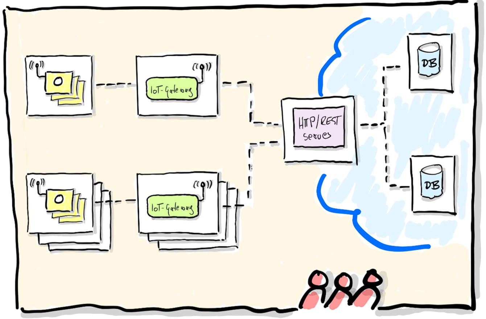

# IoT Platform

A distributed IoT platform for temperature sensor monitoring – built for the **"Distributed Systems"** university course of University of Applied Science Darmstadt.

## Architecture



**Services:** React Frontend • Java HTTP-Server (REST) • gRPC Database • IoT Gateway • HiveMQ MQTT Broker • Hazelcast Caching

---

## 🚀 Run Locally

```bash
docker compose up --build        # Start
docker compose down              # Stop
docker compose up --scale sensor=5  # Scale sensors
```

| Service | URL |
|---------|-----|
| Frontend | http://localhost |
| HTTP API | http://localhost:8080 |
| MQTT Explorer | http://localhost:4000 |
| Node-RED | http://localhost:1880 |
| Hazelcast Management | http://localhost:8081 |

---

## Raspberry Pi Cluster Deployment

Automated deployment via **Ansible** and **Docker Compose** to a Pi cluster.


### Deployment Process

The deployment is fully automated through GitLab CI/CD:


1. **Code Push** → GitLab CI/CD pipeline triggers on main branch
2. **Build** → Custom ARM64 GitLab Runner (on Pi cluster) builds Docker images
3. **Registry** → Images pushed to GitLab Container Registry
4. **Deploy** → Ansible playbooks deploy services to Pi nodes
5. **Orchestration** → Docker Compose starts services across cluster

### Configuration Files

| File | Purpose |
|------|---------|
| `hosts.yml` | Pi node inventory |
| `setup.yml` | Initial setup (directories, registry login) |
| `network_config.yml` | Cluster network configuration |
| `deploy.yml` | Main deployment orchestration |
| `docker-compose.yml` | Service definitions for Pi cluster |

### Manual Deployment

```bash
cd deploy

# Deploy
ansible-playbook setup.yml
ansible-playbook network_config.yml
ansible-playbook deploy.yml
```

**Configuration:** Adjust username in `deploy/ansible.cfg` and cluster ID in `deploy/docker-compose.yml`.
