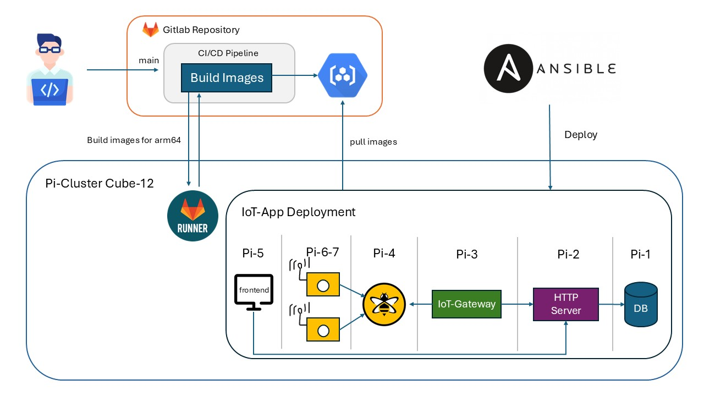
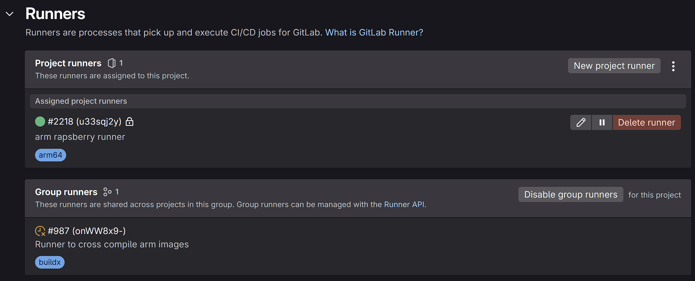

# Deployment to Pi-Cluster

## Overview
This documentation describes the deployment process of our IoT platform to a Raspberry Pi cluster. The deployment is automated using Ansible and Docker Compose, ensuring consistent and reliable deployment across all nodes.

## Architecture
The deployment consists of multiple components running on Raspberry Pi nodes:

- Frontend service
- MQTT broker
- IoT Gateway
- HTTP Server
- RPC Database



### Deployment Process
The deployment process is fully automated through GitLab CI/CD pipeline and a custom ARM64 GitLab Runner. Here's how it works:

1. **Pipeline**
   - When code is pushed to main branch of the repository, GitLab CI/CD pipeline is triggered
   - Pipeline runs on a custom ARM64 GitLab Runner installed on the Pi cluster



   - Pipeline builds Docker images for all services
   - Images are pushed to GitLab Container Registry

2. **Build and Deploy**
   - Ansible playbooks are executed to deploy the services
   - Services are started using Docker Compose

#### Configuration
The deployment is configured through several YAML files:
- `hosts.yml`: Contains the inventory of all Pi nodes
- `setup.yml`: Initial setup tasks for the nodes
  - Create application directory
  - Copy docker-compose.yml
  - Login to GitLab registry
- `network_config.yml`: Network configuration for the cluster
- `deploy.yml`: Main deployment playbook
  - Start services with docker
- `docker-compose.yml`: Container orchestration configuration specific to pi-cluster

## Accessing the Services

### Frontend
The frontend is accessible at: http://141.100.42.125/ (Pi-5)

### Other Services
- RPC Database: Available on port 50051 (Pi-1)
- HTTP Server: Available on port 8080 (P-2: http://141.100.42.122:8080)
- MQTT Broker (HiveMQ): Available on port 1883 (Pi-3)
- IoT-Gateway: (Pi-4)
- IoT-Sensors (Pi-6 and Pi-7)

## Deploy yourself

### Configuration
You need to adjust:
- In the ansible playbooks and `ansible.cfg`: Replace `stanbraeh` with your username.
- Current deployment is for **Cluster 12**. If you want to change, replace the clusterId in the ansible playbooks and `docker-compose.yml`.

### Deployment Steps
1. Open the /deploy folder in linux or WSL
2. Set these environment variables for accessing gitlab repo and pi-cluster
- `export GITLAB_USERNAME="stxxxxxxx"`
-  `export GITLAB_PASSWORD="your-gitlab-password"`
3. Execute Setup with Ansible
```bash
ansible-playbook setup.yml
```
4. Execute Network-Config with Ansible
```bash
ansible-playbook network_config.yml
```
5. Execute Deployment with Ansible
```bash
ansible-playbook deploy.yml
```
4. Check if everything is running with `docker ps` on the server