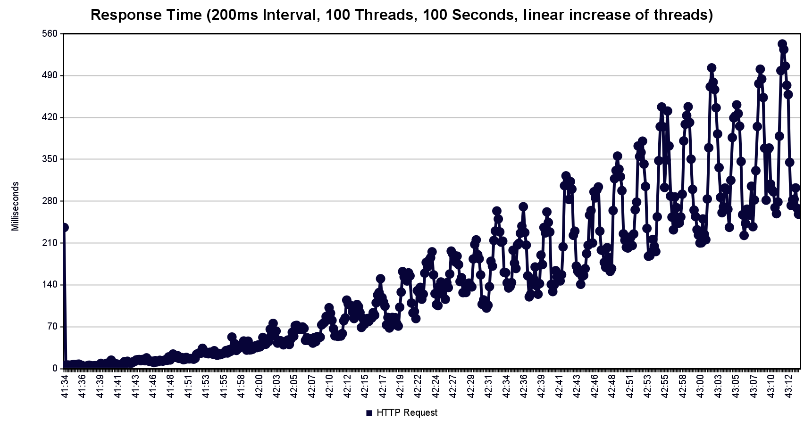

# Performance Test Evaluation

Team Members Involved:
- Ante Brähler
- Christian Neufeld

## Test Configuration

- **Tool**: Apache JMeter
- **Thread Group**: 100 threads (users)
- **Ramp-up Period**: 100 seconds (linear increase of 1 user per second)
- **Test Duration**: 100 seconds
- **Test Type**: Continuous POST requests to the API endpoint measuring Round Trip Time (RTT)

## Results Analysis

The performance test demonstrates how our HTTP server responds under gradually increasing load. 
### Graphs

The graph shows an **exponential increase** in response times as the number of concurrent users increases.

### Key Metrics

According to the aggregated results:

- **Total Samples**: 48,996
- **Average Response Time**: 103ms
- **Median Response Time**: 55ms
- **90% Line**: 267ms (90% of requests completed within this time)
- **Maximum Response Time**: 1144ms
- **Throughput**: 489.37 requests/second
- **Error Rate**: 0%

## Important Note

When replicating this test with JMeter, make sure to increase your `ephemeral port range` or reduce `TcpTimedWaitDelay` This is crucial to prevent port exhaustion issues.
