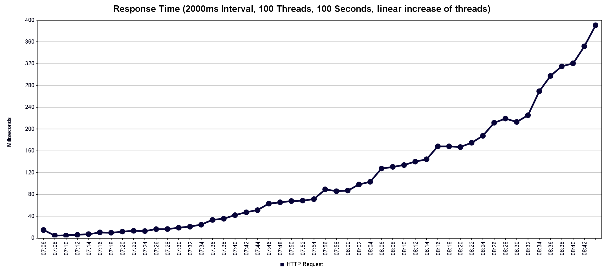

# Performance Test Evaluation

Team Members Involved:
- Ante Brähler
- Christian Neufeld

## HTTP-Server tests repeated (Prak2)

### Test Configuration

- **Tool**: Apache JMeter
- **Thread Group**: 100 threads (users)
- **Ramp-up Period**: 100 seconds (linear increase of 1 user per second)
- **Test Duration**: 100 seconds
- **Test Type**: Continuous POST requests to the API endpoint measuring Round Trip Time (RTT)

### Old Results

#### Results Analysis

The performance test demonstrates how our HTTP server responds under gradually increasing load. 
**Graphs**



The graph shows an **square increase** in response times as the number of concurrent users increases.

#### Key Metrics

According to the aggregated results:

- **Total Samples**: 67949
- **Average Response Time**: 74ms
- **Median Response Time**: 36ms
- **90% Line**: 201ms (90% of requests completed within this time)
- **Maximum Response Time**: 614ms
- **Throughput**: ~677 requests/second
- **Error Rate**: 0%

### Results with RPC

#### Results Analysis
**Graphs**


The graph shows an **square increase** in response times as the number of concurrent users increases.

#### Key Metrics

According to the aggregated results:

- **Total Samples**: 58928
- **Average Response Time**: 85ms
- **Median Response Time**: 52ms
- **90% Line**: 210ms (90% of requests completed within this time)
- **Maximum Response Time**: 937ms
- **Throughput**: ~588 requests/second
- **Error Rate**: 0%

#### Comparison with Previous Results

When comparing the RPC implementation with the previous HTTP-only implementation:

- The average and median response time increased as the RPC communication adds a new delay.
- The throughput decreased slightly from ~677 to ~588 requests/second
- The increase looks similar. However, under higher load, the increase in RPC response time is less significant.

## RPC performance tests

### Average Response Times

| Metric | RPC (gRPC) | HTTP | HTTP with RPC |
|--------|------------|------|---------------|
| Average | 3ms | 74ms | 85ms |
| Median | 3ms | 36ms | 52ms |
| 90% Line | 5ms | 201ms | 210ms |
| Max | 363ms | 614ms | 937ms |
| Throughput | 1017 req/s | 677 req/s | 588 req/s |

### Stress Test Analysis

#### Test Configuration
- **Tool**: Apache JMeter
- **Thread Group**: 100 threads (users)
- **Ramp-up Period**: 100 seconds
- **Test Duration**: 100 seconds
- **Test Type**: Continuous gRPC calls measuring Round Trip Time (RTT)

**Graphs**


#### Results Analysis

The stress test reveals a critical threshold in the RPC system's performance:

- **Total Samples**: 212110
- **Average Response Time**: 2ms
- **Median Response Time**: 2ms
- **90% Line**: 5ms
- **Maximum Response Time**: 1008ms
- **Throughput**: ~2135 requests/second
- **Error Rate**: ~37%

1. Initially, the system maintains stable response times
2. At a certain threshold there is a sudden spike in response times
   - This spike likely indicates that a system resource limit was reached (e.g., CPU saturation, I/O bottleneck, or thread pool exhaustion)
3. After the spike, the response times drop to zero
   - This indicates that the server started rejecting requests
```
Response code: 500
Response message: 14 UNAVAILABLE
```

It has a hard limit where the system becomes overwhelmed and fails completely rather than gracefully degrading.

## Important Note

When replicating this test with JMeter, make sure to increase your `ephemeral port range` or reduce `TcpTimedWaitDelay` This is crucial to prevent port exhaustion issues.
