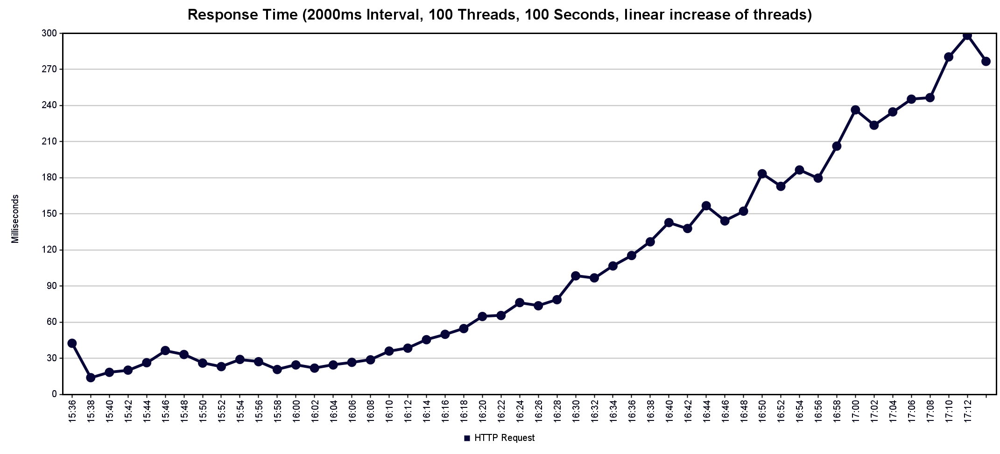
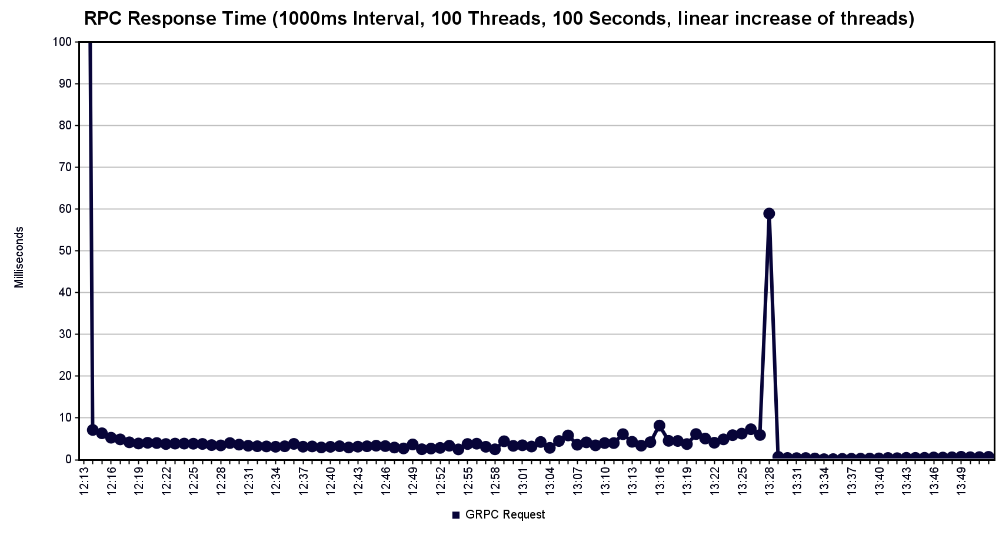
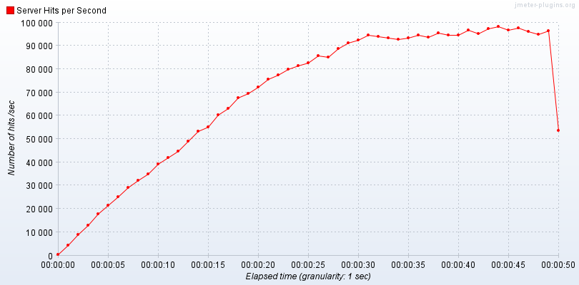

# Performance Test Evaluation

Team Members Involved:
- Ante Brähler
- Christian Neufeld

## HTTP-Server tests repeated (Prak2)

### Test Configuration

- **Tool**: Apache JMeter
- **Thread Group**: 100 threads (users)
- **Ramp-up Period**: 100 seconds (linear increase of 1 user per second)
- **Test Duration**: 100 seconds
- **Test Type**: Continuous POST requests to the API endpoint measuring Round Trip Time (RTT)

| Metric | HTTP | HTTP with RPC | HTTP with MQTT |
|--------|------|---------------| -------------- |
| Average | 74ms | 85ms | 76ms |
| Median | 36ms | 52ms | 56ms |
| 90% Line | 201ms | 210ms | 205ms |
| Max | 614ms | 937ms | 1106ms |
| Throughput | 677 req/s | 588 req/s | 651 req/s |

## RPC tests repeated (Prak3)

| Metric | RPC | RPC with MQTT |
|--------|-----|-------------- |
| Average | 3ms | 3ms |
| Median | 3ms | 3ms |
| 90% Line | 5ms | 5ms |
| Max | 363ms | 274ms |
| Throughput | 1017 req/s | 1012 req/s |

## MQTT performance tests

### Test Configuration
- **Tool**: Apache JMeter
- **Thread Group**: 450 threads (users)
- **Ramp-up Period**: 50 seconds
- **Test Duration**: 50 seconds
- **MQTT QoS**: 0
- **Test Type**: Continuous growing number of MQTT calls measuring throughput in requests/second

#### Results Analysis

- **Total Samples**: 3531270
- **Throughput**: ~70583 requests/second
- **Error Rate**: 0%

The graph initially shows a linear increase in throughput (requests/second) with a constant rise in the number of requests. Around 90k req/sec, the increase slows down and forms a plateau at approximately 100k req/sec. This indicates that the capacity limit of the local HiveMQ setup has been reached.

Further increasing the number of threads led to a rising error rate.

## Important Note

When replicating this test with JMeter, make sure to increase your `ephemeral port range` or reduce `TcpTimedWaitDelay` This is crucial to prevent port exhaustion issues.