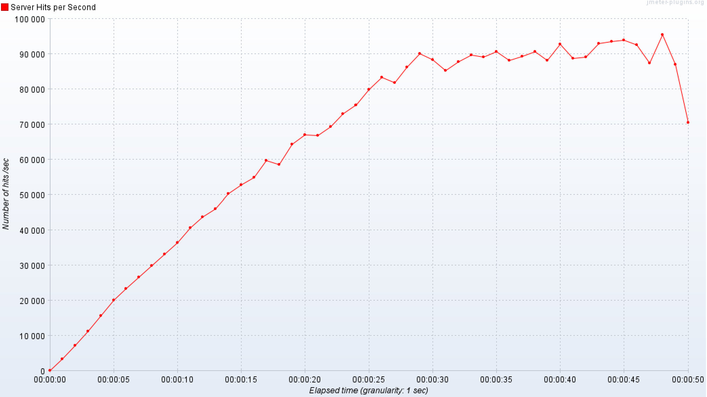

# Performance Test Evaluation

Team Members Involved:

- Ante Brähler
- Christian Neufeld

## HTTP-Server tests repeated (Prak2)

### Test Configuration

- **Tool**: Apache JMeter
- **Thread Group**: 100 threads (users)
- **Ramp-up Period**: 100 seconds (linear increase of 1 user per second)
- **Test Duration**: 100 seconds
- **Test Type**: Continuous POST requests to the API endpoint measuring Round Trip Time (RTT)

| Metric     | HTTP (Prak2) | with RPC (Prak3) | with MQTT (Prak4) | with 2PC (Prak5) |
| ---------- | ------------ | ---------------- | ----------------- | ---------------- |
| Average    | 74ms         | 85ms             | 76ms              | 145ms            |
| Median     | 36ms         | 52ms             | 56ms              | 143ms            |
| 90% Line   | 201ms        | 210ms            | 205ms             | 242ms            |
| Max        | 614ms        | 937ms            | 1106ms            | 294ms            |
| Throughput | 677 req/s    | 588 req/s        | 651 req/s         | 347 req/s        |

The response time has almost doubled with 2PC for two reasons:

- The need to send 2 requests (prepare + commit) instead of one
- For consistency in the database, we used a BlockingQueue

### Graph Analysis

**HTTP with single Data Storage**

The graph shows a **quadratic increase** (at least greater than linear) in response times as the number of concurrent users increases.

**HTTP with 2PC Data Storage**

The new graph shows no sign of an increase greater than linear. The queuing of requests in the http-server slows down the response time significantly.
The response time now scales linearly because the blocking queue serializes requests, preventing the server from being overwhelmed by the resource contention that previously caused a quadratic slowdown. The primary bottleneck is now the data storage.

## RPC tests repeated (Prak3)

| Metric     | RPC (Prak3) | with MQTT (Prak4) | with 2PC (Prak5) |
| ---------- | ----------- | ----------------- | ---------------- |
| Average    | 3ms         | 3ms               | 2ms              |
| Median     | 3ms         | 3ms               | 3ms              |
| 90% Line   | 5ms         | 5ms               | 4ms              |
| Max        | 363ms       | 274ms             | 317ms            |
| Throughput | 1017 req/s  | 1012 req/s        | 1073 req/s       |

No increase in RPC response time was detected, as a single RPC-database instance alone is not influenced by 2PC.

## MQTT tests repeated (Prak4)

### Test Configuration

- **Tool**: Apache JMeter
- **Thread Group**: 450 threads (users)
- **Ramp-up Period**: 50 seconds
- **Test Duration**: 50 seconds
- **MQTT QoS**: 0
- **Test Type**: Continuous growing number of MQTT calls measuring throughput in requests/second

| Metric             | MQTT (Prak4)  | with 2PC (Prak5) |
| ------------------ | ------------- | ---------------- |
| Samples            | 3531270       | 3342507          |
| Throughput average | 70583 req/sec | 67115 req/sec    |

No major difference detected, which makes sense as the MQTT tests were not influenced by the redundant data storage. The MQTT throughput is measured between MQTT publisher and subscriber and therefore only depends on the MQTT broker.

#### Graph Analysis

The graph initially shows a linear increase in throughput (requests/second) with a constant rise in the number of requests. Around 90k req/sec, the increase slows down and forms a plateau at approximately 100k req/sec. This indicates that the capacity limit of the local HiveMQ setup has been reached.

Further increasing the number of threads led to a rising error rate.

## Important Note

When replicating this test with JMeter, make sure to increase your `ephemeral port range` or reduce `TcpTimedWaitDelay`. This is crucial to prevent port exhaustion issues.
